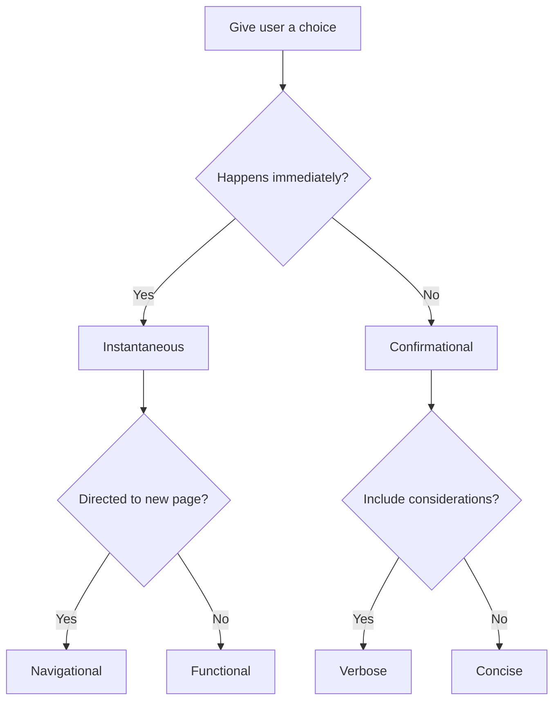

import Aside from '@components/Aside.astro';

If you believe in free-will, options are most likely a foundational aspect of your philosophy. Designers are responsible for presenting choices to users so that they may select the best option and advance toward a goal. Historically, we have introduced several patterns which support the ability for users to make a choice. In this exploration we will consider some common interface components and understand why we might decide to use one over another.
## Ground rules

The abstract concept we'll be focusing on is a group of similar items and the ways they can be presented and interacted. This means singular buttons and inline links aren't included in this exploration.

The act of creating an option will also be avoided. Generally speaking, once the option is created, it'll be included within the existing presentational group of options using one of the approaches described. An example of this might be creating a post category for use in tagging entries in a blog.

While important, this exploration will not be focusing on the curation of the content within an option. Certainly, poor choices in wording or inaccessible options will inhibit the user from making the best choice. The following exploration assumes options are well-crafted.

## Definitions

The following patterns will be referenced throughout this exploration:

- [Button groups](https://developer.microsoft.com/en-us/fluentui#/controls/web/commandbar): Examples are found in word processing tools for selecting text alignment.
- [Radio button groups](https://www.lightningdesignsystem.com/components/radio-group/): Examples are found in online surveys to rate quality of service.
- [Checkbox groups](https://react-spectrum.adobe.com/react-spectrum/CheckboxGroup.html): Examples are found in selecting options to filter products.
- [Native HTML select options](https://carbondesignsystem.com/components/select/usage): Examples are found when selecting locations from a list.
- [Navigational menus](https://baseweb.design/components/header-navigation/): Examples are found in the header of marketing sites.
- [Context menus](https://v2.grommet.io/menu): Examples are found as right-click to copy.
- [Tab groups](https://www.newskit.co.uk/components/tabs/): Examples are found within web pages as secondary navigation.

<Aside>
### Button group confusion

What I've defined as button group above is not a common button group [found amongst most design systems](https://component.gallery/components/button-group/). The key difference here is the keyboard navigation. A button group is often delivered as just a layout pattern of existing buttons with very little change of visual style and no change in interaction pattern. Each button is accessible via the `Tab` key like any other button that isn't in a group. Because of this, I identify these as groups of individual buttons. There's nothing stopping most systems to allow any sort of interactive component to exist in these groups; like links for example. For this I recommend providing a layout component instead of something specific for buttons.

However, I am specifically calling out the pattern found in toolbars as it is expected to be a single tab stop, where navigation between buttons is done by arrow keys. Visually these are groups of buttons but with a different and warranted enhancement for accessibility. This pattern can also be found in [listboxes](https://www.w3.org/WAI/ARIA/apg/patterns/listbox/), [comboboxes](https://www.w3.org/WAI/ARIA/apg/patterns/combobox/), and [menus](https://www.w3.org/WAI/ARIA/apg/patterns/menubutton/) which also expect arrow key navigation between options within a single tab stop. A [segmented control](https://component.gallery/components/segmented-control/) is also of the same family but more related to radio buttons.

To reiterate, this behavior is not meant for usage with most groups of buttons found within an interface, as each is commonly expected to be an individual tab stop.
</Aside>

It's also important to define a few terms used for accessibility:

- **Tab stop**: An area of the interface which is focused by the `Tab` key where additional actions can occur. Links and text input fields are clear tab stop examples, but entire lists of options can also be defined as a single tab stop. The area that should be identified as a tab stop is achieved through accessibility best practices for an experience.
- **Roving tabindex**: A technique to show focus on an element without the use of the `Tab` key. This is done by toggling the `tabIndex` of interactive elements. One element in the list will receive a `tabIndex="0"`, while the rest receive `tabIndex="-1"`. This allows the user to re-enter the area using the `Tab` key and return focus back to the previously focused element. [Here's a video explaining the technique by Rob Dodson](https://www.youtube.com/watch?v=uCIC2LNt0bk&t=6s).

<Aside>
### Accessibility is not easy

There's a great deal of nuance when attempting to make options accessible. While the w3 attempts to provide [guidance on best practices](https://www.w3.org/WAI/ARIA/apg/patterns/), achieving intended results can be challenging. For example, [the guidelines claim](https://www.w3.org/WAI/ARIA/apg/practices/keyboard-interface/#x6-6-2-managing-focus-in-composites-using-aria-activedescendant) the following: 

> If a component container has an ARIA role that supports the `aria-activedescendant` property, it is not necessary to manipulate the tabindex attribute and move DOM focus among focusable elements within the container.

However, [testing completed by Zell Liew](https://zellwk.com/blog/element-focus-vs-aria-activedescendant/) concluded that `aria-activedescendant` is not well supported for assistive technologies. It's important to put your best efforts toward marking the options for visibiity to all users and their methods of interaction.

</Aside>

## Instant gratification

One of the attributes of making a selection is the immediate result of the interaction. Patterns that show new content based on the selection are commonly immediate. For example, navigational menus which redirect to new content should be instant. Buttons that update state like deleting a row of data are also expected to happen quickly.

This is in contrast to options which expect a user to make selections and then commit those selections in a final action. This is commonly form elements such as radio buttons, checkboxes and HTML selects. The user will choose these options but no updates to the larger system will be made until the user sends a final command. This is often the case for wizard experiences also, where the act of going to the next step submits the options selected before traversing further.

This means we can divide the patterns into some groups:

- **Instantaneous**
  - Button groups
  - Navigational menus
  - Context menus
  - Tab groups

- **Confirmational**
  - Radio button groups
  - Checkbox groups
  - Native HTML select options

## Links vs Buttons

Full disclosure, I am a big proponent for clarity of intent. I believe links should have an underline and navigate to new pages, allowing for all the default behaviors an `<a/>` tag provides. Buttons should have visible padding and execute actions on the current page, allowing for all the default behaviors a `<button/>` tag provides. With that out of the way, there's additional level of consideration for the difference.

Links (`<a/>` elements) are meant to be individual tab stops _always_. This means that if the link is meant to be navigational and sends the user to a new page, the user should be able to go to this element using just the `Tab` key.

For buttons (`<button/>` elements), this isn't the case when prepared as a proper group of related controls. The group is expected to be a single tab stop. Once within the tab stop, a roving tabindex pattern is used to traverse the controls.

This is a good place to introduce the tab user interface pattern which commonly is treated to look like manilla folder tabs. If the tab interface you prepare expects each tab to be a navigational link that can be revisited using the browser's URL bar, this means that each tab is an individual tab stop; as link behavior is expected. On the other hand, if each tab is meant to execute a command, thereby keeping the user on the same page, then the entire tab group is one tab stop with roving tabindex navigation. In this way the tab pattern can either act as a navigational menu (using links), or a button group (using buttons). The main decision goes back to the links versus buttons debate to decide which experience to use.

<Aside>
### Etymology of tab

Tangentially, the word tab has two definitions for this exploration:

- **Tab (n.)**: a second or further document or page that can be opened on a spreadsheet or web browser. Compare also Middle English _tab_ "strap or string" (mid-15c.), Norwegian dialectal _tave_ "piece of cloth, rag."
- **Tab (v.)**: to press the tab key on a computer or typewriter. As a short form of _tabulator key_ of a typewriter (later computer) it is recorded from 1916.

Confusingly, you often do not move between tabs using the tab key. Such is the wonderful world of English and computer interfaces.

</Aside>

Let's continue to group our patterns:

- **Instantaneous**
  - **Navigational**
    - Navigational menus
    - Tab groups*
  - **Functional**
    - Button groups
    - Context menus
    - Tab groups*

- **Confirmational**
  - Radio button groups
  - Checkbox groups
  - Native HTML select options

## Confirmation follows form

Returning to the confirmational group, these are patterns most commonly found in forms. This aligns to the way which we would fill out paper forms by entering in all the information first before submitting. 

One of the most clear indications of usage between these patterns of the group is between checkboxes and radio buttons. Checkboxes are meant for selecting more than one option, while radio buttons are used for selecting a single exclusive option.

<Aside>

### Keyboard interactivity differences

Another important difference between checkbox and radio groups is the tab stops. Each checkbox is a single tab stop, while an entire group of radio buttons is a single tab stop with arrow key navigation. This is built into HTML as long as the `name` property is correctly applied.

</Aside>

Interestingly, the native HTML select allows for both configurations (using the `multiple` attribute for multiple selections). So the question is, why use the native HTML select when there are other patterns which more clear usage?

One of the properties of the HTML select is the limited amount of data shown. The element is restrictive to a word or phrase which represents the value for selection. The other patterns allow for much more information. In relation, the select only displays the selected value. This means that it is less likely that the user will review the selection since it requires extra interaction. Laying out all the options as checkboxes or radio buttons help the user consider all the possibilities. Additionally, the HTML select options are not bound to the page layout; its options will exist separately from visual flow. This supports the basis of using checkboxes and radios for options which need more detail from options that are concise.

<Aside>

### Multiple problems

The `multiple` attribute which could be added to the HTML select is not a common pattern in user interface design. On desktop devices, additional keys must be introduced in order to choose multiple options and the keys to use vary between desktop operating systems (`Ctrl` (windows) or `Cmd` (Mac)). Touch devices commonly provide these as checkboxes instead which helps users identify the ability to choose more than one. Due to these properties I would recommend avoiding the HTML select for choosing multiple options and instead present a list of checkboxes or a similar but consistent pattern.

</Aside>

Let's break down the options one more time:

- **Instantaneous**
  - **Navigational**
    - Navigational menus
    - Tab groups*
  - **Functional**
    - Button groups
    - Context menus
    - Tab groups*

- **Confirmational**
  - **Verbose**
    - **Exclusive**
      - Radio button groups
    - **Multiple**
      - Checkbox groups
  - **Concise**
    - Native HTML select options

## Flow

Here's a visual representation of our decision tree:

The flow chart above can help lead a path toward a decision by asking **why**...

- Why does the user need the action to happen immediately?
- Why does the user need to remain on the page?
- Why does the user need more information about this choice?

Adding purpose to these decisions will ultimately support design decisions with clarity. You can be confident that the pattern chosen is the best one based on the answers to these questions.

## Unavailable options

A pattern that may be examined is disabling an option. This could occur because the user hasn't satisfied criteria or the system is not yet prepared to offer the option. Opinions vary about the decision of showing options that the user is unable to select. I believe the following questions can determine if showing a option as disabled is helpful to the user.

- Will the option be available to the user if criteria are met?
- Are the criteria for the option clearly shown in context of the option?

If the answer to the questions are "yes" then it may be appropriate to disable the option. However, note that disabled options aren't detectable to screen readers and commonly lack sufficient color contrast. Providing the criteria for enabling the option will support these deficits. [Vitaly Friedman goes into greater detail at Smashing Magazine](https://www.smashingmagazine.com/2021/08/frustrating-design-patterns-disabled-buttons/).

To put it simply, if it isn't important why include it in the experience? This segues into the next topic.

## Abundant options

Presenting the user with too many options introduces a cognitive load and decision paralysis. As described by [Hick's Law](https://lawsofux.com/en/hicks-law/), the more choices you present, the longer it will take to reach a decision. This might include halting the current flow to return to at a later time. In contrast, limiting the number of options will improve the user experience. While some patterns expect to provide dozens of choices (eg. country of origin), there might be better design choices to capture the same information (eg. text field filtering of the list).

Use empathy to drive your design choices and your users will be thankful.

