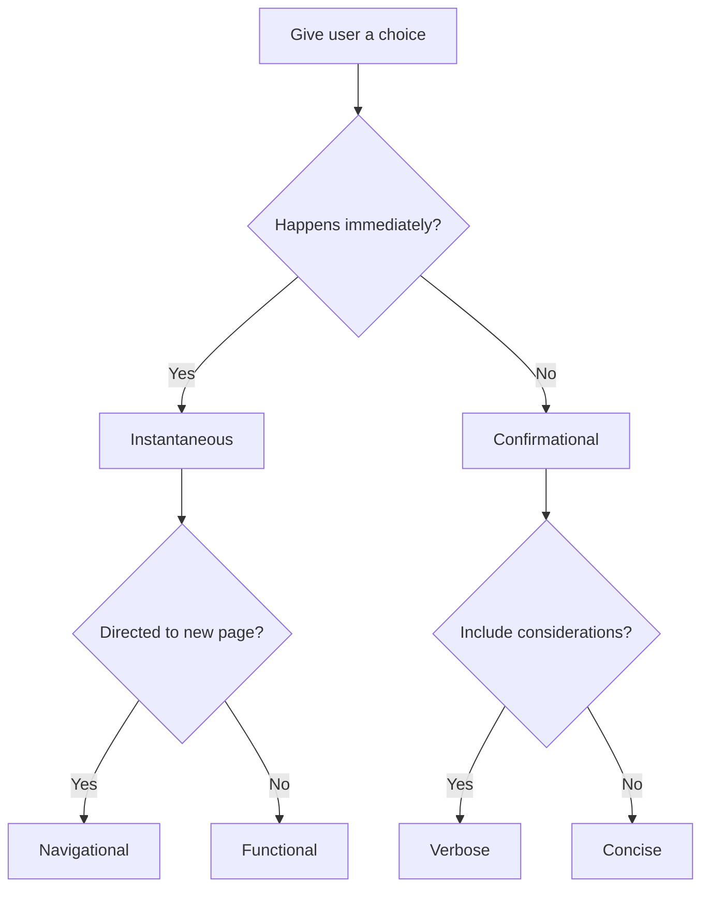

We often use a restaurant's menu to make the decision whether or not to visit. The menu itself is a list of options that the visitor can choose to eat from. Making a selection could either be by ordering from waitstaff or perhaps some more high-tech means. Either way, the act of making a selection is completed where the user expects some result based on their choice.

The web offers several different means of choosing an option. We'll explore them to inform our decisions for designing experiences.

## Ground rules

The pattern we'll be focusing on is a group of similar items and the ways they can be presented and interacted. This means singular buttons and inline links aren't included in this exploration.

The act of creating an option will also be avoided. Generally speaking, once the option is created, it'll be included within the existing group of options using one of the patterns described. An example of this might be creating a post category.

## Definitions

The following patterns will be referenced throughout this exploration:

- [Button groups](https://developer.microsoft.com/en-us/fluentui#/controls/web/commandbar): Examples are found in word processing tools for selecting text alignment.
- [Radio button groups](https://www.lightningdesignsystem.com/components/radio-group/): Examples are found in online surveys to rate quality of service.
- [Checkbox groups](https://react-spectrum.adobe.com/react-spectrum/CheckboxGroup.html): Examples are found in selecting options to filter products.
- [Native HTML select options](https://carbondesignsystem.com/components/select/usage): Examples are found when selecting locations from a list.
- [Navigational menus](https://baseweb.design/components/header-navigation/): Examples are found in the header of marketing sites.
- [Tab groups](https://www.newskit.co.uk/components/tabs/): Examples are found within web pages as secondary navigation.


### Button group confusion

What I've defined as button group above is not a common button group [found amongst most design systems](https://component.gallery/components/button-group/). The key difference here is the keyboard navigation. A button group is often delivered as just a layout pattern of existing buttons with very little change of visual style and no change in interaction pattern. Each button is accessible via the `Tab` key like any other button that isn't in a group. Because of this, I identify these as groups of individual buttons. There's nothing stopping most systems to allow any sort of interactive component to exist in these groups; like links for example.

I am specifically calling out the pattern found in toolbars as it is expected to be a single tab stop, where navigation between buttons is done by arrow keys. Visually these are groups of buttons but with a different and warranted enhancement for accessibility.

Admittedly, for the purposes of the exploration this deviation isn't critical to our final decision tree but still worth calling out.


It's also important to define a few terms used for accessibility:

- **Tab stop**: An area of the interface which is focused by the `Tab` key where additional actions can occur. Links and text input fields are clear tab stop examples, but entire lists of options can also be defined as a single tab stop. The area that should be identified as a tab stop is achieved through accessibility best practices for an experience.
- **Roving tabindex**: A technique to show focus on an element without the use of the `Tab` key. This is done by toggling the `tabIndex` of interactive elements. One element in the list will receive a `tabIndex="0"`, while the rest receive `tabIndex="-1"`. This allows the user to re-enter the area using the `Tab` key and return focus back to the previously focused element. [Here's a video explaining the technique by Rob Dodson](https://www.youtube.com/watch?v=uCIC2LNt0bk&t=6s).

## Instant gratification

One of the attributes of making a selection is the immediate result of the interaction. Patterns that show new content based on the selection are commonly immediate. For example, navigational menus which redirect to new content should be instant. Buttons that update state like deleting a row of data are also expected to happen quickly.

This is in contrast to options which expect a user to make selections and then commit those selections in a final action. This is commonly form elements such as radio buttons, checkboxes and HTML selects. The user will choose these options but no updates to the larger system will be made until the user sends a final command. This is often the case for wizard experiences also, where the act of going to the next step submits the options selected before traversing further.

This means we can divide the patterns into some groups:

- **Instantaneous**
  - Button groups
  - Navigational menus
  - Tab groups

- **Confirmational**
  - Radio button groups
  - Checkbox groups
  - Native HTML select options

## Links vs Buttons

Full disclosure, I am a big proponent for clarity of intent. I believe links should have an underline and navigate to new pages, allowing for all the default behaviors an `<a/>` tag provides. Buttons should have visible padding and execute actions on the current page, allowing for all the default behaviors a `<button/>` tag provides. With that out of the way, there's additional level of consideration for the difference.

Links (`<a/>` elements) are meant to be individual tab stops _always_. This means that if the link is meant to be navigational and sends the user to a new page, the user should be able to go to this element using just the `Tab` key.

For buttons (`<button/>` elements), this isn't the case when prepared as a group. The group is expected to be a single tab stop. Once within the tab stop, a roving tabindex pattern is used to traverse the controls.

This is a good place to introduce the tab user interface pattern which commonly is treated to look like manilla folder tabs. If the tab interface you prepare expects each tab to be a navigational link that can be revisited using the browser's URL bar, this means that each tab is an individual tab stop; as link behavior is expected. On the other hand, if each tab is meant to execute a command, thereby keeping the user on the same page, then the entire tab group is one tab stop with roving tabindex navigation. In this way the tab pattern can either act as a navigational menu (using links), or a button group (using buttons). The main decision goes back to the links versus buttons debate to decide which experience to use.

Let's continue to group our patterns:

- **Instantaneous**
  - **Navigational**
    - Navigational menus
    - Tab groups*
  - **Functional**
    - Button groups
    - Tab groups*

- **Confirmational**
  - Radio button groups
  - Checkbox groups
  - Native HTML select options

## Confirmation follows form

Returning to the confirmational group, these are patterns most commonly found in forms. This aligns to the way which we would fill out paper forms by entering in all the information first before submitting. 

One of the most clear indications of usage between these patterns of the group is between checkboxes and radio buttons. Checkboxes are meant for selecting more than one option, while radio buttons are used for selecting a single exclusive option.

Interestingly, the native HTML select allows for both configurations (using the `multiple` attribute for multiple selections). So the question is, why use the native HTML select when there are other patterns which more clear usage?

One of the properties of the HTML select is the limited amount of data to show. The element is restrictive to a word or phrase which represents the value for selection. The other patterns allow for much more information. In relation, the select only displays the selected value. This means that it is less likely that the user will review the selection since it requires extra interaction. Laying out all the options as checkboxes or radio buttons help the user consider all the possibilities. Additionally, the HTML select options are not bound to the page layout; its options will exist separately from visual flow. This supports the basis of using checkboxes and radios for options which need more detail from options that are concise.

Let's break down the options one more time:

- **Instantaneous**
  - **Navigational**
    - Navigational menus
    - Tab groups*
  - **Functional**
    - Button groups
    - Tab groups*

- **Confirmational**
  - **Verbose**
    - **Exclusive**
      - Radio button groups
    - **Multiple**
      - Checkbox groups
  - **Concise**
    - Native HTML select options

## Flow

Here's a visual representation of our decision tree:

## Putting into practice

Let's see how this exploration can inform a hypothetical experience. We can imagine an interface that allows the user to filter products. First, we can deduce if the changes should happen immediately or happen after confirmation. Some filtering patterns allow for many options to be selected before loading results while others allow for a single option to execute the filter. This will depend on some factors but at least we can start climbing down the tree.

From here, if the filtering options are immediate, they could navigate to a new page which allows the user to bookmark the results. This is the decision that results in the identification of link or button usage. Buttons would be used if new pages are not created based on filtering configurations.

Meanwhile, if the user is expected to choose several options at once in a confirmational filtering scheme, this does not normally require much thought. This is an opportunity to use a much more simple interface like an HTML select.

Recognize that the container in which these treatments are placed is irrelevant to the experience expectations. This means that whether the options flyout from a menu or are rendered inline within a page does not matter.